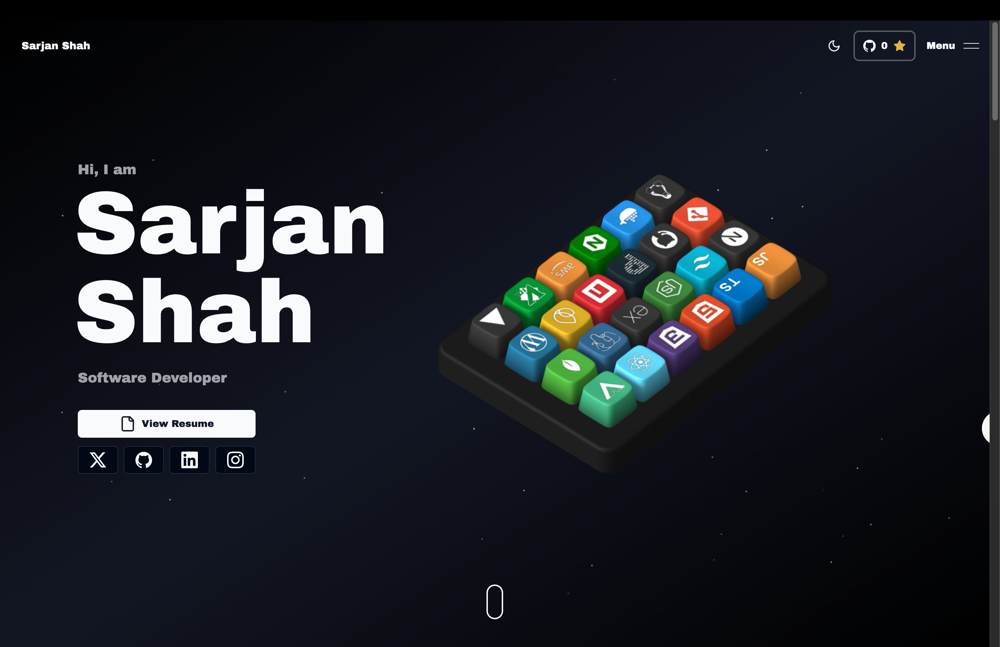

# 🚀 Sarjan Shah — Portfolio Website

Welcome to the repository for my personal portfolio website! This is where I showcase my skills, projects, and personality through immersive 3D animations, smooth interactions, and fluid motion. If you love creative, high-impact web experiences, you’re in the right place.



---

## 🔥 Features

* **3D Animations**
  A custom interactive 3D keyboard built using **Spline**, where each key represents a skill and reveals its title and description on hover.

* **Slick Interactions**
  Smooth scroll, hover, and reveal animations powered by **GSAP** and **Framer Motion** for a premium feel.

* **Space-Inspired Theme**
  Particle effects on a dark background create a cosmic environment that elevates the visual experience.

* **Fully Responsive Design**
  Optimized for desktops, tablets, and mobile devices to ensure a consistent experience everywhere.

* **Modern & Innovative UI**
  A blend of creativity and performance-focused design, pushing the boundaries of modern web development.

---

## 🛠️ Tech Stack

### Frontend

* **Next.js**
* **React**
* **Tailwind CSS**
* **Shadcn UI**
* **Aceternity UI**

### Animations & 3D

* **GSAP**
* **Framer Motion**
* **Spline Runtime**

### Miscellaneous

* **Resend**
* **Socket.IO**
* **Zod**

---

## 🚀 Getting Started

### Prerequisites

* **Node.js** (v14 or higher)
* **npm** or **yarn**

### Installation

1. Clone the repository:

   ```bash
   git clone https://github.com/sarjanshah/portfolio.git
   ```

2. Navigate to the project directory:

   ```bash
   cd portfolio
   ```

3. Install dependencies:

   ```bash
   npm install
   # or
   yarn install
   ```

4. Start the development server:

   ```bash
   npm run dev
   # or
   yarn dev
   ```

5. Open your browser and visit:

   ```
   http://localhost:3000
   ```

---

## 🚀 Deployment

This portfolio is deployed on **Vercel**.

To deploy your own version:

1. Push the project to a GitHub repository.
2. Connect the repository to Vercel.
3. Vercel automatically builds and deploys the site.

---

## 🤝 Contributing

Contributions, suggestions, and improvements are always welcome.
Feel free to open an issue or submit a pull request.

---

## 📄 License

This project is open source and available under the **MIT License**.

---

### 👋 About Me

I’m **Sarjan Shah**, a passionate developer focused on building visually engaging, performant, and modern web experiences.
This portfolio reflects my skills, creativity, and approach to crafting high-quality user interfaces.
